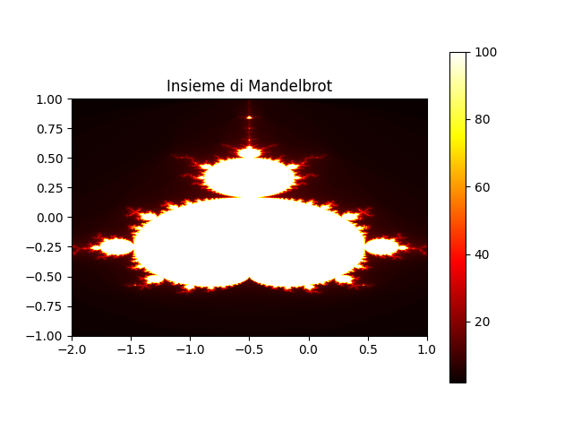

# Mandelbrot Set Explorer

This Python script generates and visualizes the Mandelbrot set, allowing users to explore its intricate patterns and beauty.

## Repository Name: Mandelbrot-Explorer

## Instructions

1. Ensure you have Python installed on your system.
2. Clone or download this repository (`Mandelbrot-Explorer`) to your local machine.

## Usage

1. Open a terminal or command prompt.
2. Navigate to the directory where the script is located.
3. Run the script using the following command:

   ```bash
   python mandelbrot_generator.py
Adjust parameters in the script (if needed) to explore different regions of the Mandelbrot set.
## Script Details
The script includes functions for Mandelbrot computation and visualization.

### Parameters
- width, height: Dimensions of the generated image.
- xmin, xmax, ymin, ymax: Range of the complex plane to explore.
- max_iter: Maximum number of iterations for the Mandelbrot computation.
Feel free to modify the script and explore different settings to create captivating Mandelbrot visualizations.

### Plot



Enjoy exploring the fascinating world of the Mandelbrot set!
